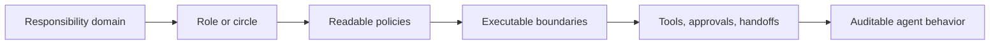

# Org-aware agents

Patterns and architecture notes for building AI agents that operate from explicit roles, responsibility domains, policies, approvals, and audit trails rather than free-form prompting.

This repository is a docs-first extraction from production work around governance layers for humans and AI agents.

## Core idea

Most agent stacks optimize for model quality and tool orchestration.

In real organizations, delegation fails earlier:
- ownership is unclear
- agents do not know their responsibility boundaries
- risky actions need approvals
- cross-agent coordination becomes implicit and fragile
- policy changes happen in chat instead of through explicit governance

The approach here is to make organizational semantics executable:
- domains of responsibility
- roles and circles
- human-readable policies
- permission boundaries
- consent / approval loops
- auditable handoffs between actors

## Repository map

- `docs/responsibility-model.md` — how domains, roles, circles, and policies become agent context
- `docs/consent-and-policy-loop.md` — how agents and humans coordinate through approvals and policy changes
- `docs/execution-surface.md` — why the execution plane should stay sandboxed, explicit, and auditable
- `docs/engineering-workflow-example.md` — an example of how these ideas apply to a multi-agent engineering workflow

## Who this is for

- founders building AI-native companies
- staff/principal engineers designing agent platforms
- infra / platform teams working on execution runtimes
- product engineers who need safer end-to-end delegation

## Background

These notes are influenced by:
- Sociocracy 3.0
- Holacracy-inspired governance
- agentic execution systems with permissions and audit
- production B2B workflow software

## Contact

- LinkedIn: <https://www.linkedin.com/in/agritsev/>
- Website: <https://gritsevich.com>

