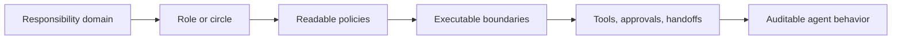

# Org-aware agents

Patterns and architecture notes for building AI agents that operate from explicit roles, responsibility domains, policies, approvals, and audit trails rather than free-form prompting.

This repository is a docs-first public condensation of production work around governance layers for humans and AI agents.

The shortest useful summary is:
- agents should be first-class organizational actors, not prompt wrappers
- governance and approvals should be system protocols, not chat habits
- execution should run in a separate, scoped, auditable plane
- retrieval and rich answers should respect organizational boundaries and source traceability

If that problem space matters to you, start with `docs/quick/`.
If you want the system model and technical boundaries, go to `docs/deep/`.

## How to read this repo

If you want the short version:
- `docs/quick/responsibility-model.md`
- `docs/quick/consent-and-policy-loop.md`
- `docs/quick/execution-surface.md`
- `docs/quick/engineering-workflow-example.md`
- `docs/quick/support-and-refunds-example.md`

If you want the deeper public architecture:
- `docs/deep/system-overview.md`
- `docs/deep/system-model.md`
- `docs/deep/governance-protocols.md`
- `docs/deep/runtime-architecture.md`
- `docs/deep/agentic-rag-and-rich-results.md`
- `docs/deep/implemented-vs-planned.md`

## Core idea

Most agent stacks optimize for model quality and tool orchestration.

In real organizations, delegation fails earlier:
- ownership is unclear
- agents do not know their responsibility boundaries
- risky actions need approvals
- cross-agent coordination becomes implicit and fragile
- policy changes happen in chat instead of through explicit governance

The approach here is to make organizational semantics executable:
- domains of responsibility
- roles and circles
- human-readable policies
- permission boundaries
- consent / approval loops
- auditable handoffs between actors

## What is different here

This is not a generic "give the agent better prompts" approach.

The working assumption is that serious delegation inside organizations needs:
- explicit responsibility domains instead of vague role blur
- the same operating language for humans and agents
- policy questions to become governance events
- a separate execution plane with scoped context and audit
- retrieval that respects organization boundaries and task semantics
- structured answers that can be rendered natively instead of dumped as free text

## Why read this repo

Read this if you care about:
- governance-first agent architecture rather than prompt choreography
- separate control-plane and runner/execution-plane design
- org-aware retrieval, agentic RAG, and source-backed AI answers
- structured AI interfaces through `A2UI`, with `AG-UI + A2UI` as the target direction

## Production-backed ingredients

The deeper docs in this repository are based on real work around:
- domain-aware actor models for humans and agents
- async consent and policy update loops
- separate runner / execution surfaces for external and internal agents
- organization-aware retrieval, agentic RAG, and knowledge tools
- structured AI results through `A2UI`, with `AG-UI + A2UI` as the target platform direction

Some of this is implemented, some is an active architecture direction, and some remains roadmap.
That split is called out explicitly in `docs/deep/implemented-vs-planned.md`.

## Repository map

Quick read:
- `docs/quick/responsibility-model.md` — short thesis on why responsibility should precede prompting
- `docs/quick/consent-and-policy-loop.md` — short thesis on governance events instead of chat improvisation
- `docs/quick/execution-surface.md` — short thesis on keeping execution bounded and auditable
- `docs/quick/engineering-workflow-example.md` — lightweight example of a bounded multi-agent engineering flow
- `docs/quick/support-and-refunds-example.md` — concrete example of policy-bounded support automation with financial risk controls

Deep dive:
- `docs/deep/system-overview.md` — one-page architecture view across domains, governance, retrieval, runner, and UI
- `docs/deep/system-model.md` — domains, roles, circles, actors, shared entities, permission envelopes, handoffs
- `docs/deep/governance-protocols.md` — async consent, policy change loops, actor participation, and UX projection
- `docs/deep/runtime-architecture.md` — control plane vs execution plane, runners, leases, artifacts, and trust boundaries
- `docs/deep/agentic-rag-and-rich-results.md` — org-aware retrieval, agentic RAG, semantic search, and structured AI UI
- `docs/deep/implemented-vs-planned.md` — what is production-backed, what is current direction, and what is intentionally omitted

## Companion code repos

These notes have small public code companions that expose isolated implementation slices:
- [agent-code-playbook-kit](https://github.com/gritsev/agent-code-playbook-kit) — process IR and deterministic runtime playbooks
- [agent-code-runner-sandbox](https://github.com/gritsev/agent-code-runner-sandbox) — bounded execution primitives, locks, and delivery validation
- [agent-code-observer-mcp](https://github.com/gritsev/agent-code-observer-mcp) — semantic observer contracts and thin MCP bridging
- [agent-code-a2ui-contracts](https://github.com/gritsev/agent-code-a2ui-contracts) — rich-answer contracts, compatibility keys, and normalization helpers

The docs explain the architecture story. The `agent-code-*` repos show narrow executable patterns from that story.

## Who this is for

- founders building AI-native companies
- staff/principal engineers designing agent platforms
- infra / platform teams working on execution runtimes
- product engineers who need safer end-to-end delegation

## Background

These notes are influenced by:
- Sociocracy 3.0
- Holacracy-inspired governance
- agentic execution systems with permissions and audit
- production B2B workflow software

## Scope note

This repository is intentionally not a full internal documentation dump.

It omits:
- customer-specific workflows and data
- internal code paths and private infrastructure details
- secrets, credentials, and deployment specifics
- parts of the product that are unrelated to the org-aware agent thesis

The goal is not completeness.
The goal is to publish a coherent public architecture story that still feels technically real.

## Contact

- LinkedIn: <https://www.linkedin.com/in/agritsev/>
- Website: <https://gritsevich.com>
