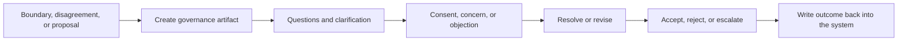

# Governance protocols

This document is the detailed public version of the thesis in `../quick/consent-and-policy-loop.md`.

The central principle is:
- ambiguity with operational or policy impact should become a governance event
- it should not disappear into chat history

## 1. Why this layer exists

Multi-agent systems do not fail only because of tool errors.

They also fail because they eventually hit questions like:
- is this action allowed
- who has authority to approve it
- does the current policy still make sense
- should this exception be temporary or codified
- which actor should decide

If these answers live only in conversation, the system becomes ungovernable.

## 2. Decision artifacts, not chat fragments

A serious system needs explicit decision artifacts.

Publicly useful examples are:
- tension: a problem, signal, or pressure that requires handling
- proposal: a candidate change
- development plan: a structured improvement artifact for a person or team
- policy update: an explicit modification of operating rules

Those objects create a place where:
- participation is visible
- status is visible
- objections or concerns are visible
- the final outcome is visible

## 3. Actor participation should include agents

If the governance model is supposed to work for human-agent systems, participant lists cannot be hard-coded to humans only.

That is why a shared actor reference matters:

```ts
type ActorRef = {
  kind: 'user' | 'agent';
  id: string;
  name?: string;
};
```

That makes it possible to model:
- human-only decisions
- human-agent approvals
- agent-agent disagreements with human escalation

## 4. Async consent as a first-class protocol

Synchronous meetings are not enough.

In practice, many real decisions need an asynchronous path with:
- explicit participants
- deadlines
- visible states
- repeatable outcomes

Two useful consent modes are:
- `explicit_all`: every participant must react explicitly
- `silence_after_deadline`: silence until deadline counts as consent unless an objection appears

This is not just process theory.
It directly affects system behavior, notification design, and audit.

## 5. Canonical flow

A public-safe simplified flow looks like this:



The crucial property is the last step.

The decision result should not remain in chat.
It should modify the operating system:
- artifact status
- policy state
- assigned work
- notifications
- audit history

## 6. Policy updates as part of normal operation

Agents should not only follow policies.
They should also know when a policy question exists.

A useful pattern is:
1. an agent encounters a boundary or risky exception
2. it does not improvise beyond scope
3. it creates or joins a governance process
4. the result is one of:
   - approval for a single action
   - rejection
   - clarification request
   - policy update proposal

This is what makes autonomy improvable over time instead of brittle.

## 7. UX projection matters

The machine can hold the state, but the human interface should not feel like raw workflow internals.

A practical projection is:
- the main UX lives in the relevant artifact card
- participants see clear "action required" surfaces
- notifications and inbox views show pending governance work
- an inspector view can still exist for debugging and operators

This avoids a common failure mode where:
- the workflow engine knows what is happening
- but the humans do not

## 8. What this changes operationally

Once governance is explicit:
- agent behavior becomes safer
- riskier actions have a path other than "guess"
- manager bottlenecks shrink because approval semantics are clearer
- policy evolution becomes part of the system rather than an oral tradition

## 9. Practical rule

High-risk ambiguity should create a governance artifact, not a clever prompt.
