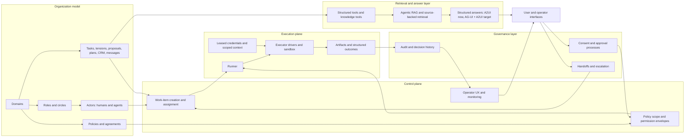

# System overview

This page gives a one-frame public view of the whole architecture.

It is intentionally simplified, but it shows how the main pieces fit together:
- organizational model
- governance protocols
- retrieval and knowledge surfaces
- control plane
- execution plane
- operator and user UI

## 1. Whole-system view

## 2. How to read the diagram

### Organization model

This is the source of operational meaning:
- which domains exist
- who carries responsibility
- which policies apply
- which artifacts represent work and decisions

### Governance layer

This is where ambiguity becomes explicit process:
- approvals
- objections
- policy changes
- handoffs between domains or actors

### Control plane

This decides what may happen:
- work-item creation
- assignment
- policy scope
- operator visibility

### Retrieval and answer layer

This decides what the agent can know and how it can present that knowledge:
- exact structured data
- source-backed narrative context
- rich, inspectable answers

### Execution plane

This is where side effects happen:
- work is claimed
- executor drivers run
- credentials are leased
- artifacts and structured outcomes are produced

## 3. Why the split matters

A lot of agent systems blur these boundaries.

That creates hidden failure modes:
- the model has more authority than the organization intended
- policy and approval logic gets duplicated in prompts
- retrieval mixes exact facts with narrative evidence
- execution side effects are harder to inspect

This architecture tries to prevent that by keeping each layer legible.

## 4. A practical reading order

If you want the high-level narrative:
1. `../quick/responsibility-model.md`
2. `../quick/consent-and-policy-loop.md`
3. `../quick/execution-surface.md`

If you want the deeper system:
1. `system-model.md`
2. `governance-protocols.md`
3. `runtime-architecture.md`
4. `agentic-rag-and-rich-results.md`

If you want a concrete scenario after that:
1. `../quick/support-and-refunds-example.md`
2. `../quick/engineering-workflow-example.md`
