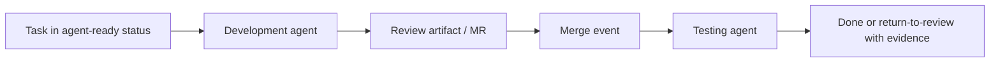

# Engineering workflow example

## The scenario

Imagine a multi-agent engineering workflow with two specialist agents:
- development agent
- testing agent

The goal is not to create "more AI activity".
The goal is to move real engineering work through a bounded, auditable workflow without humans doing all the coordination.

## What usually goes wrong

Without an explicit operating model:
- both agents work on the wrong part of the problem
- testing starts without clear ownership of quality gates
- merge and post-merge behavior is ambiguous
- approvals are improvised in chat
- the system has no stable explanation for why a status changed

## What changes with org-aware agents

### Responsibility layer

- the development role owns turning a task into a code change and review artifact
- the testing role owns post-merge verification and regression control
- both roles operate inside clearly named responsibility domains

### Policy layer

- task statuses are explicit workflow boundaries
- certain transitions can happen automatically
- risky actions can require approval
- definition of done becomes machine-checkable

### Execution layer

- the development agent can work in a repository sandbox
- the testing agent can run a test pyramid in a bounded environment
- handoffs are visible in artifacts and audit records

## A simple flow

## Why this is better than prompt choreography

The main benefit is not that the prompts are smarter.

The main benefit is that:
- the roles are explicit
- the boundaries are explicit
- the handoffs are explicit
- the policy changes are explicit

That is what makes delegation safer and more scalable.

