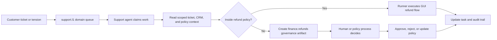

# Support and refunds example

This is a concrete public example of how org-aware agents can automate real operational work without collapsing governance, risk, and execution into one blob.

The scenario is intentionally simple:
- customer support handles many low-value refunds
- the partner portal has no API
- the business wants faster turnaround without turning the AI into an unbounded finance superuser

## 1. Organizational setup

Two domains matter:
- `support.l1`: first-line customer support
- `finance.refunds`: financial controls, refund policy, and exception handling

The key design choice is that the support agent is not "the refund AI."
It is an actor operating inside the `support.l1` domain with a limited permission envelope.

That envelope might allow:
- reading the support ticket and relevant CRM context
- preparing and executing refunds up to a small threshold
- updating the support task or case
- using a GUI automation tool against the partner portal

It should not allow:
- arbitrary refunds above policy limits
- bypassing finance review for VIP or risky cases
- making up policy exceptions in chat

## 2. Why this example matters

This scenario forces all the important architecture questions to show up at once:
- responsibility boundaries
- approval rules
- handoffs between domains
- sandboxed execution
- source-backed context
- audit and operator visibility

That is why it is a better proof case than a generic "helpful assistant" demo.

## 3. A bounded operating flow

## 4. Context and retrieval

Even in a small scenario, the agent should not rely on one giant prompt.

It needs scoped context from real artifacts such as:
- the ticket or task
- customer status and CRM facts
- refund policy or agreement
- relevant domain constraints
- previous actions or audit events

That context may come from:
- structured tools for exact status and customer facts
- knowledge tools for policy language or historical notes

The important property is that the evidence remains attributable.

## 5. Execution path

Because the partner portal has no API, the execution plane may need browser or GUI automation.

That does not remove the need for control.
It increases it.

The runner path should therefore be bounded by:
- allowlisted commands and hosts
- a scoped context bundle
- temporary credentials or leases
- structured outcome reporting
- captured artifacts for later audit

The system should be able to answer:
- what was attempted
- with what authority
- against which policy boundary
- what changed in the external portal
- what was written back to the operating system

## 6. Governance boundary

The interesting moment in this scenario is not the happy path.
It is the exception path.

Examples:
- refund amount is above threshold
- customer is VIP
- the evidence is incomplete
- the case conflicts with current policy

At that point the correct behavior is not "be creative."
The correct behavior is:
- stop autonomous execution
- create a governance or approval artifact
- route it to the right domain or actor
- persist the outcome back into the system

This is where `support.l1` stops being a domain owner for the decision and `finance.refunds` becomes the relevant authority.

## 7. What makes this architecture stronger

Compared with a naive automation flow, this design preserves:
- domain ownership
- financial limits
- explainable escalation
- auditable side effects
- cleaner policy evolution over time

Compared with human-only operation, it can still reduce:
- ticket handling load
- refund turnaround time
- integration tax for legacy external systems

## 8. Why this is a good public example

It is concrete enough to feel real, but general enough to apply across:
- ecommerce support
- partner operations
- back-office exception handling
- workflow systems with partial automation and partial human control

It also shows the core claim of this repository:
- the value is not "AI did a refund"
- the value is that delegation stayed governable
