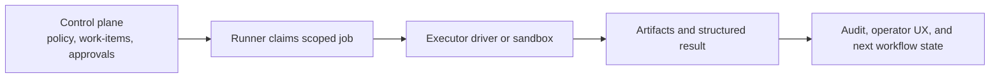

# Runtime architecture

This document is the detailed public version of the thesis in `execution-surface.md`.

The main boundary is:
- control plane: policy, assignment, approval, audit, operator UX
- execution plane: the place where tools actually run near repositories, APIs, infrastructure, and secrets

## 1. Why this split matters

Agent systems become dangerous when orchestration and execution collapse into one trust boundary.

That usually creates:
- hidden standing access
- weak operator visibility
- fuzzy approval semantics
- hard-to-explain side effects

The stronger the model becomes, the more important this split gets.

## 2. Control plane responsibilities

The control plane should own:
- who the actor is
- what responsibility domains apply
- what policy scope is active
- what approvals are still required
- what work-item is available to claim
- how outcomes are recorded
- what operators can inspect or interrupt

It is the place where delegation remains explainable.

## 3. Execution plane responsibilities

The execution plane should own:
- claiming work
- receiving a scoped context bundle
- running the allowed tools or executor drivers
- producing structured results
- uploading artifacts
- emitting audit-friendly outcomes

It should not own:
- inventing policy
- bypassing approvals
- broad standing permissions without scope
- product semantics that belong in the control plane

## 4. Scoped context bundles

A useful job payload is not just "task text".

It should carry an explicit bundle such as:
- work-item identity
- actor identity
- responsibility and policy scope
- allowed tools and hosts
- temporary credentials or leases
- artifact and result paths
- delivery and timeout rules

That makes execution more deterministic and more auditable.

## 5. Credentials should be leased, not ambient

A practical rule for production systems:
- do not keep broad secrets permanently sitting in runner environment variables if you can avoid it

Prefer:
- per-job leases
- narrowly scoped connections
- credentials injected only for the duration of execution

This reduces the blast radius and improves explainability.

## 6. Runner and executor patterns

One helpful pattern is:
- the control plane creates work-items
- a runner claims them
- the runner prepares the scoped context
- the runner launches an executor driver
- the result is written back as structured outcome plus artifacts

Executor drivers can vary:
- CLI-based tools
- sandboxed command runners
- browser automation tools
- specialized SDK-backed executors

In the production systems behind these notes, one of the important directions is a separate runner layer with SDK-backed execution, including Codex SDK-backed paths, rather than collapsing everything into the main app process.

## 7. Public-safe execution invariants

The execution plane should preserve:
- explicit allowlists for commands and hosts
- stable timeout and delivery policy
- structured result contracts rather than "looks good"
- auditable artifacts
- the ability to stop or revoke a run cleanly

These are not implementation details.
They are part of the trust model.

## 8. MCP and semantic tool surfaces

Another useful boundary is to keep semantic tool contracts separate from the low-level execution runtime.

That means:
- product semantics live in public or semi-public API surfaces
- execution bridges stay thin
- internal and external agent clients can rely on the same tool descriptions

This reduces duplicated truth between:
- the public API
- the MCP layer
- internal agent prompts
- runner-specific adapters

In practice, this is useful when the same semantic surface needs to serve:
- external MCP clients
- internal analyst agents
- runner-side execution bridges

## 9. A reference flow

## 10. Practical rule

A stronger model is not a substitute for a narrower execution surface.
